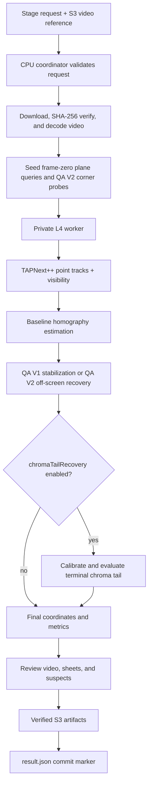

# TAPNext++ tracking architecture

This document describes how `tapnextpp-modal-app` turns one normalized studio
video and four frame-zero screen corners into a per-frame screen homography.
It also describes the optional `chromaTailRecovery` pass, which can repair one
narrow class of terminal tracking failure without changing normal baseline
tracking.

## Design goals

- Track the complete TV surface as one coherent quadrilateral.
- Preserve projective motion instead of moving four corners independently.
- Continue producing explicit geometry when part of the TV leaves the camera
  frame.
- Keep GPU inference private and return only compact tracking data to the CPU
  coordinator.
- Make the chroma-assisted repair opt-in, observable, and conservative.
- Abstain when the green screen is destructively occluded or otherwise lacks
  sufficient evidence.
- Store all durable inputs and outputs in S3; use local storage only as
  per-call scratch space.

## System boundary

The app has one public Modal workflow function and one private GPU function:

- `run_tracking_stage` is the S3-native CPU coordinator. It validates the
  stage request, decodes the video, calls the GPU worker, builds final
  geometry, optionally runs chroma tail recovery, renders review evidence, and
  uploads artifacts.
- `track_stage_points_s3` is the private L4 GPU boundary. It independently
  downloads and verifies the input video, runs TAPNext++, and returns point
  tracks and visibility to the coordinator inside Modal.
- `health` returns deployment and model metadata without allocating a GPU.



The GPU does point tracking only. Homography construction, QA recovery,
chroma analysis, review rendering, and S3 publication happen in the CPU
coordinator.

## Source files

- `app.py` defines the Modal images and functions and orchestrates the complete
  stage.
- `tracking_stage.py` validates the stage contract and implements verified S3
  input/output helpers.
- `tracking_geometry.py` seeds queries, estimates baseline projective
  geometry, resolves partial/off-screen frames, computes metrics, selects
  suspects, and renders review artifacts.
- `chroma_arbitration.py` measures green-screen geometry, calibrates the bezel
  inset, scores candidates, applies safety gates, and implements the terminal
  tail latch.
- `tests/` covers request validation, tracking geometry, chroma scoring,
  occlusion abstention, review generation, and the complete synthetic
  RGB-to-homography recovery path.

## Request and coordinate spaces

The request supplies four corners in source-video pixel coordinates in this
fixed order:

```text
top-left, top-right, bottom-right, bottom-left
```

Three coordinate spaces are used:

- Source space is the decoded video's native pixel size. Chroma measurements
  are made here so they use all available image detail.
- Analysis space is the tracking canvas requested by the caller. TAPNext++
  point outputs, resolved corners, and the published per-frame corner arrays
  use this space.
- Surface space is the logical inserted composition, such as a 900×1280
  weather graphic. Each published 3×3 homography maps the canonical surface
  corners into the resolved analysis-space TV corners.

Conversions between source and analysis space are independent X/Y scales.
Corner order is preserved at every boundary.

## Stage request and idempotency

`validate_stage_request` checks the complete relationship between the run ID,
input hash, S3 keys, expected media, output prefix, corners, dimensions, QA
version, and optional chroma settings. The current media limit is 720 frames
at exactly 24 fps.

The coordinator calculates a fingerprint of the normalized `parameters`
object. A committed result is reused only when its run ID, input hash, stage,
and parameter fingerprint all match. This prevents a baseline-only result from
being returned for a later chroma-assisted request using the same video.

The output prefix remains based on the run ID and input hash. Running different
parameter sets under the same prefix recomputes and replaces those artifacts.
Use a new run ID when baseline and assisted outputs must remain available for
side-by-side comparison.

## Baseline tracking pipeline

### 1. Query seeding

`seed_queries` converts the four source corners to analysis space. The default
`perimeter-32` layout places eight points just inside each TV edge. The inset
keeps the queries on screen content rather than on the bezel.

An opt-in `hybrid-24-edge-8-interior` experiment uses six points per edge plus
a projected normalized 4×2 interior lattice. It still produces exactly 32
plane queries and does not change the four QA V2 recovery probes. The hybrid
is not the production default: on the controlled uniform-green clip it
produced fewer direct frames and a much longer recovery interval because
interior observations supported a coherent but incorrect projective fit.

`perimeter-32-plus-interior-8` keeps the original perimeter queries unchanged
and appends the same interior lattice, producing 40 plane queries plus four QA
V2 probes. It also remains experimental. On the controlled clip it passed the
60% inlier gate at the decisive frame but selected temporally inconsistent
geometry and entered terminal recovery much earlier than the perimeter
baseline. Adding more fixed points does not make ambiguous uniform-green
correspondences trustworthy.

QA V2 appends four exact corner probes in TL/TR/BR/BL order. These probes are
not included in the normal RANSAC homography. They provide independent partial
and off-screen observations when the 32 plane points become weak.

### 2. TAPNext++ inference

The GPU worker converts the frame-zero queries back to source pixels and
streams decoded frames through the pinned TAPNext++ 512×512 checkpoint.
Queries are initialized only on frame zero. Model positions are scaled back to
analysis space before returning:

```text
tracks:     [frame, query, x/y]
visibility: [frame, query]
```

The model is loaded once per warm GPU container. TF32 is disabled and the
random seeds are fixed for repeatable inference.

### 3. Direct projective geometry

For every frame, `estimate_raw_frames` selects visible in-frame plane points
and fits a homography with OpenCV RANSAC using a 3-pixel reprojection
threshold. The frame-zero TV corners are projected through that homography.

A direct result is accepted as `good` only when it satisfies all relevant
checks:

- at least eight RANSAC inliers;
- at least a 60% inlier ratio;
- finite, convex geometry;
- an area between 10% of the reference and the configured maximum ratio;
- no implausible displacement or area jump relative to recent good frames.

Rejected states remain visible in the output as `low_confidence`,
`invalid_geometry`, `temporal_reject`, or `insufficient_points`.

### 4. Geometry resolution

QA V1 retains the historical path: use good direct frames, interpolate missing
frames, apply a five-frame median filter, and finish with an EMA.

QA V2 resolves each non-good frame as one coherent quadrilateral:

1. Predict the next quad from the prior two resolved quads with a partial
   affine transform, falling back to median translation.
2. Compare any visible exact corner probes with the prediction.
3. With at least two trustworthy probes, estimate one coupled
   translation/rotation/scale correction. Individual corners are never
   overwritten independently.
4. If no correction is trustworthy, use prediction for up to 24 terminal
   frames and then hold the last valid quad.
5. If a later direct observation exists, bridge the hidden interval toward
   that re-entry anchor.
6. Smooth the coherent resolved sequence and record off-screen visibility.

Each QA V2 frame records a `resolutionSource`:

- `direct`: accepted 32-point projective tracking;
- `partial-affine`: prediction corrected by trustworthy corner probes;
- `predicted`: coherent motion prediction only;
- `bridged`: an offline hidden gap aligned to a later direct observation;
- `held`: the last valid geometry after prediction becomes unsafe.

This resolved sequence is the baseline for all outputs and remains the final
sequence unless the optional chroma tail policy fully qualifies.

## Opt-in `chromaTailRecovery`

### Purpose and scope

The policy targets one observed failure mode: direct projective tracking stops
near the end of a clip and QA V2 continues with a smooth partial-affine
trajectory, but that simpler transform no longer matches the TV's perspective.

It is not a general replacement tracker. It cannot alter ordinary direct
tracking, a non-terminal recovery interval, or a terminal interval shorter
than the configured minimum. It ignores raw TAPNext++ corner candidates.

The policy is disabled by default and requires `qaVersion: 2`:

```json
"chromaTailRecovery": {
  "enabled": true,
  "minimumTailFrames": 12,
  "acquisitionFrames": 3,
  "scoreMargin": 0.04,
  "minimumScore": 0.90,
  "minimumPrecision": 0.95,
  "transitionFrames": 6
}
```

### 1. Chroma measurement

The coordinator uses the already decoded RGB frames and converts them to BGR
for OpenCV. For each frame it:

1. thresholds HSV using the configured green range;
2. retains the largest connected green component;
3. fits an ordered convex quadrilateral to that component;
4. records the fitting method and component rectangularity.

Missing, tiny, or degenerate components become explicit unavailable evidence;
they do not fail the baseline tracking stage.

### 2. Bezel-to-green calibration

The visible green fill is normally inset from the black outer bezel. Treating
the measured green quad as the TV's outer edge would therefore shrink or
misalign the composition.

Calibration uses only frames whose baseline state is `good` and whose
`resolutionSource` is `direct`. Each measured green quad is normalized into
the baseline outer quad's unit square. Implausible samples are removed, then a
median model and median-absolute-deviation residual filter produce a robust
four-corner inset model. At least three plausible samples are required.

For a later frame, the inverse mapping projects the canonical outer unit square
through the measured inner green quad. This yields the calibrated outer bezel
candidate in source space.

If calibration is unavailable, the policy records
`calibration-unavailable` and publishes the unchanged baseline.

### 3. Per-frame evidence

Both the baseline outer quad and calibrated chroma candidate are evaluated
against the measured component. The score combines:

```text
0.45 × F1 overlap + 0.25 × intersection-over-union
                  + 0.30 × positive per-edge transition score
```

Every edge is sampled independently just inside and outside its predicted
green boundary. A tail frame is supported only when all four edges are
supported, candidate score and precision meet their thresholds, and the
trajectory gates accept it.

The chroma candidate must also pass:

- a coherent-transform gate limiting corner residual, scale, rotation, and
  translation relative to the previous accepted chroma candidate;
- a temporal-prediction gate limiting departure from recent chroma motion;
- stronger four-edge evidence when reacquiring after a measurement gap.

During acquisition, the frame must be non-direct and chroma must beat the
baseline score by `scoreMargin`. If the baseline lacks enough evidence to
produce a score, a fully supported chroma candidate may still win.

### 4. Terminal-tail decision

The latch is applied only when all of the following are true:

1. A continuous non-direct baseline run reaches the final frame.
2. Its length is at least `minimumTailFrames`.
3. At least `acquisitionFrames` consecutive frames satisfy acquisition.
4. Supported chroma evidence remains continuous from the confirmation frame
   through the end of the clip.

The last rule is the destructive-occlusion safety gate. If a presenter erases
enough green edges after confirmation, the entire tail repair abstains rather
than guessing through the occlusion.

Decision reasons include:

- `latched-terminal-chroma-tail`;
- `no-terminal-recovery-tail`;
- `terminal-recovery-tail-too-short`;
- `no-sustained-acquisition-evidence`;
- `chroma-support-not-continuous-through-tail`;
- `calibration-unavailable`.

### 5. Offline hand-off and publication

Once acquisition is confirmed, the policy uses only the calibrated chroma
projection through the end. It never alternates between raw, baseline, and
chroma candidates.

Because all frames are already available, a bounded smoothstep transition can
start before the confirmation frame. Pre-roll frames are included only if
their chroma candidate was already supported. The transition therefore hides
the visual hand-off without importing failed evidence or using future geometry
as an occlusion bridge.

When the latch applies, the coordinator:

- converts the selected source-space corners back to analysis space;
- preserves each original `corners` value as `baselineCorners`;
- writes final `corners` and recomputes the surface-to-TV `homography`;
- records `chromaTailSource`, `chromaTailWeight`, and
  `chromaTailEvidence` per frame;
- recomputes displacement, area, centroid, and homography-jump metrics from
  the geometry actually published;
- reruns suspect selection against those final metrics;
- labels assisted frames as `tailBlend` or `chromaTail` in review evidence.

If the latch abstains, published geometry remains baseline geometry. The
summary still records why the policy did not apply, and successful calibration
still produces per-frame diagnostic evidence.

## Outputs and evidence

The coordinator always uploads:

- `coordinates.json`: reference geometry, per-frame corners and homographies,
  recovery provenance, and optional chroma evidence;
- `metrics.json`: complete quality and motion series;
- per-attempt validated request and stdout/stderr debug records.

With `evidenceMode: full`, it also uploads:

- `review/tracking-review.mp4` with final geometry overlaid on every frame;
- overview JPEG sheets containing up to 30 consecutive frames each;
- annotated full-resolution suspect frames.

With `evidenceMode: none`, geometry and metrics are unchanged, while review
rendering is skipped and the returned suspect list is empty.

Every artifact is uploaded with its SHA-256 metadata and verified with an S3
HEAD request. `result.json` is uploaded last and acts as the stage commit
marker. Raw model tracks never become public S3 artifacts.

## Safety invariants

- Existing requests remain baseline-only because chroma recovery defaults to
  disabled.
- Chroma recovery requires QA V2 provenance and cannot be enabled on QA V1.
- The green inset is calibrated from direct good frames rather than assuming
  the green and bezel boundaries coincide.
- All four chroma edges must support an applied tail frame.
- Raw tracker candidates are ignored by the tail policy.
- Corners are transformed coherently; no independent corner snapping occurs.
- A missing or destructively occluded chroma signal causes abstention.
- A failed chroma decision does not fail or alter valid baseline tracking.
- Final homographies, motion metrics, suspects, and review overlays all refer
  to the same published corner sequence.

## Testing

Run the local suite from this directory:

```bash
uv sync --dev
uv run pytest
uv run python -m py_compile \
  app.py tracking_stage.py tracking_geometry.py chroma_arbitration.py
```

The chroma tests include correct-versus-shifted scoring, missing-green
abstention, calibrated inset recovery, coherent and temporal spike rejection,
destructive occlusion, deterministic terminal latching, supported pre-roll,
and an end-to-end synthetic RGB-frame recovery that verifies final
homographies.
